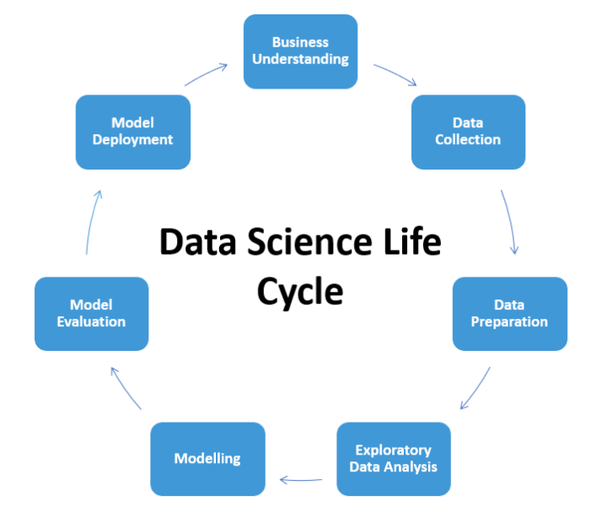

## You shouldn't be a DATA SCIENCE GENERALIST!!!

* DATA SCIENCE isn’t a single, well-defined field, and companies don’t hire generic “data scientists”, but rather individuals with very specialized skill sets.

* And it’s hard to avoid becoming a generalist. That’s why Jeremie Harris put together a list of five problem classes that are often lumped under the “data science” heading:

```code
1. DATA ENGINEER: managing data pipelines for companies that deal with large volumes of data.
2. DATA ANALYST: translating data into actionable business insights.
3. DATA SCIENTIST: cleaning and exploring datasets, as well as making predictions that deliver business value.
4. MACHINE LEARNING ENGINEER: building, optimizing and deploying machine learning models to production.
5. MACHINE LEARNING RESEARCHER: finding new ways to solve challenging problems in both data science and deep learning.
```

## Data Science Life Cycle


## Link original
* [What is the life cycle of a data science project?](https://www.quora.com/What-is-the-life-cycle-of-a-data-science-project)
* [Why you shouldn’t be a data science generalist](https://towardsdatascience.com/why-you-shouldnt-be-a-data-science-generalist-f69ea37cdd2c)