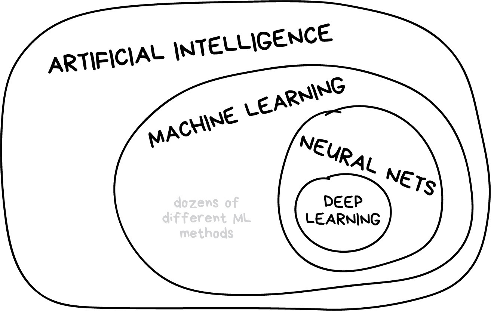

## COMPONENTS of MACHINE LEARNING

* The only goal of ML is to predict results based on incoming data. All ML tasks can be represented this way, or it's not an ML problem from the beginning.

* The greater varieties in samples, the easier it is to find relevant patterns and predict the result. Therefore, there are 3 components to teach the machine:

```code
1. DATA: the more diverse the data, the better the result.
2. FEATURES: a.k.a parameters or variables.
3. ALGORITHMS: the method you choose affects the precision, performance, and size of the final model.
```

## Images


-------



-------


-------


-------


-------


-------


## Link original

* [Machine Learning for Everyone](https://vas3k.com/blog/machine_learning/?fbclid=IwAR0sso_-2mxSQ3dT8fvhM2YsYf5nNzxQ-KpI7DLbU4sESpZhPNZbKu9i_4c)

