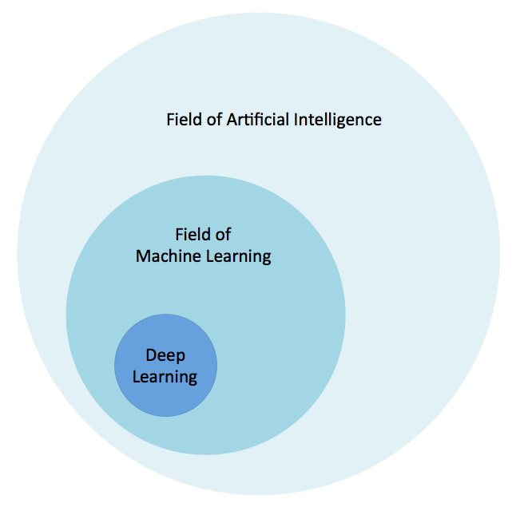

## SOFTWARE AND FRAMEWORKS TO USE

* TensorFlow™ - an open source software library for numerical computation using data flow graphs.
https://www.tensorflow.org/

* Caffe2 - an easy and straightforward way for you to experiment with deep learning and leverage community contributions of new models and algorithms.
https://caffe2.ai/

* Torch - a scientific computing framework with wide support for machine learning algorithms.
https://torch.ch/

* Theano - a Python library that lets you define, optimize, and evaluate mathematical expressions.
https://deeplearning.net/software/theano/introduction.html

* ConvNetJS - a Javascript library for training Deep Learning models (like Neural Networks) entirely in your browser.
https://cs.stanford.edu/people/karpathy/convnetjs/

## LIST OF CHEAT SHEETS 
* Kailash Ahirwar has made such a dedicated work via Medium by gathering cheat sheets from different sources for those who want to embark on their ML/DL learning journey.

👉Keras
👉Numpy
👉Pandas
👉Scipy
👉Matplotlib
👉Scikit-learn
👉Neural Networks Zoo
👉ggplot2
👉PySpark
👉R Studio
👉Jupyter Notebook
👉Dask

### WHY IMPORTANT
* Deep Learning is important for one reason, and one reason only: we’ve finally been able to achieve meaningful, useful accuracy on tasks that matter.
	+ Computer vision - is a great example of a task that Deep Learning has transformed into something realistic for business application. Facebook has had major success with identifying faces in photographs.
	+ Speech recognition - is another area that has felt Deep Learning’s impact.

### Images

### Link original
* [An Introduction to Deep Learning](https://blog.algorithmia.com/introduction-to-deep-learning/?fbclid=IwAR3Pz9DaV3-_yqA_TtLdayMwzFO_4hl9v_SEvDf8qvFZk9sovU7TtGLMMC4)

* [Essential Cheat Sheets for Machine Learning and Deep Learning Engineers](https://startupsventurecapital.com/essential-cheat-sheets-for-machine-learning-and-deep-learning-researchers-efb6a8ebd2e5)

